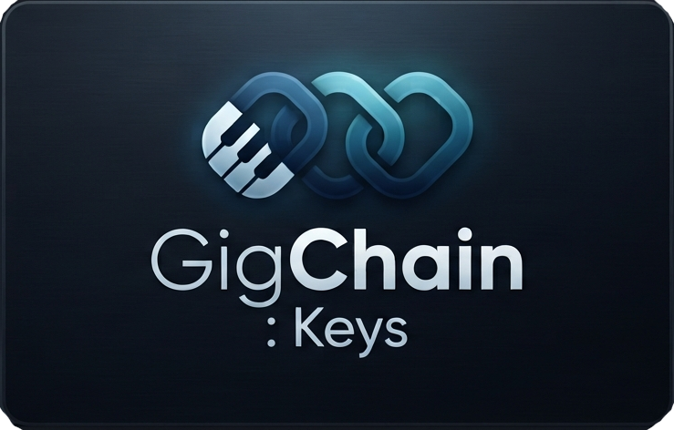
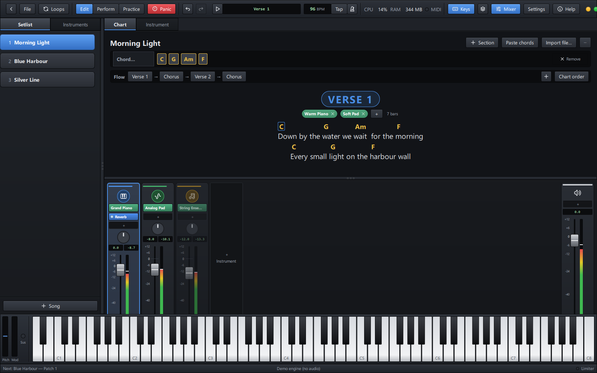
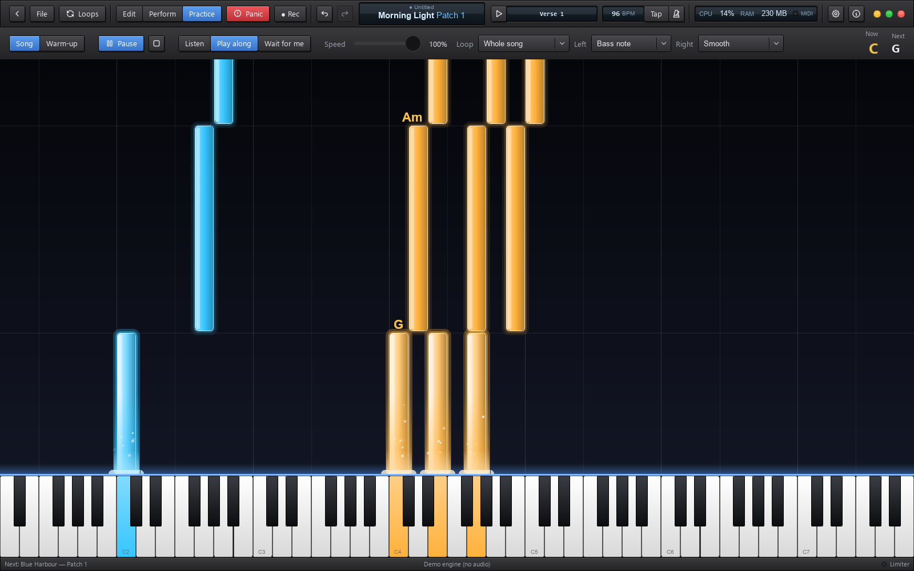
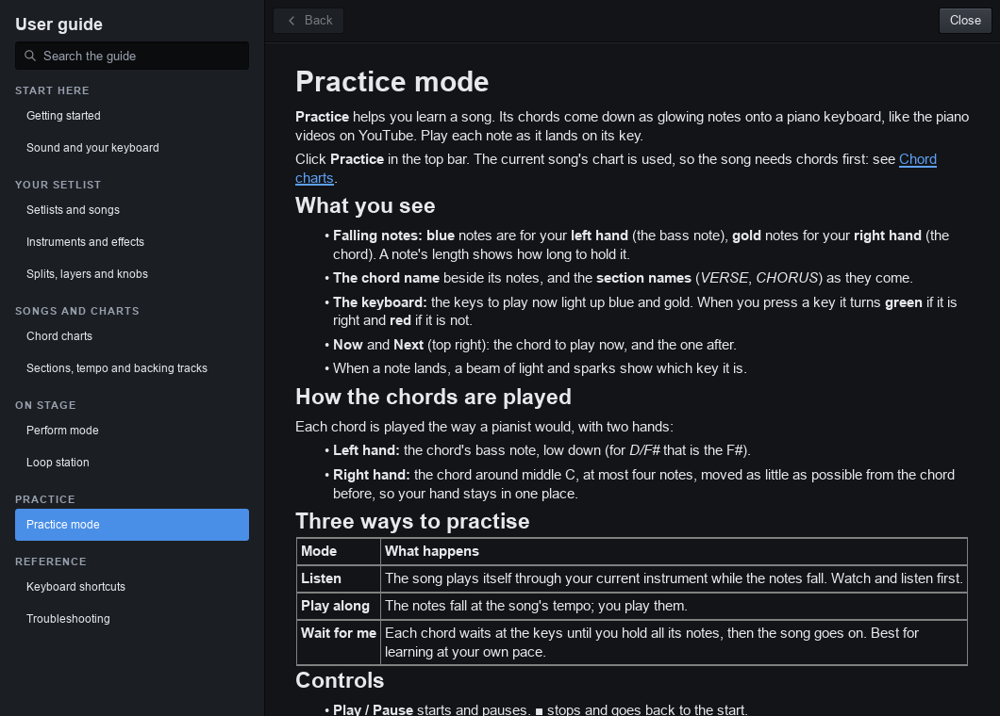

  

<h3 align="center">Your whole keyboard rig on stage: sounds, setlist, chord charts and practice, in one free app.</h3>

  
  
  
  
  

  <a href="#download"><b>Download</b></a> ·
  <a href="docs/help/getting-started.md"><b>Getting started</b></a> ·
  <a href="docs/help/README.md"><b>User guide</b></a> ·
  <a href="SUPPORT.md"><b>Get help</b></a> ·
  <a href="CHANGELOG.md"><b>What's new</b></a> ·
  <a href="https://github.com/sponsors/xDarkzx"><b>♥ Sponsor</b></a>

---

**GigChain Keys** is a live-performance host for keyboard players, in the
spirit of MainStage and Gig Performer. It plays the VST3 instruments and
effects already on your computer, keeps every song of the night in a
**setlist** with its own sounds, shows each song's **chords and lyrics**
big enough to read from the keys, and turns those chords into notes falling
onto a keyboard so you can **practise** them.

It is **free**, with no adverts, no licence keys and no nag screens. It is
open source too, under the GPL.

> **Beta.** GigChain Keys is young. It is used and tested on real rigs, but
> features and file formats can still change between versions. Keep a copy
> of your setlists, and please [tell us what breaks](SUPPORT.md).

  

## Download

| System | Download | Notes |
|---|---|---|
| **Windows 10 / 11** (64-bit) | [**Installer** (`GigChainKeys-<version>-x64-setup.exe`)](https://github.com/xDarkzx/GigChain-Keys/releases/latest) | Recommended. Installs for you or for everyone, upgrades in place, uninstalls from *Apps & features*. |
| | [Portable zip (`GigChainKeys-<version>-x64-portable.zip`)](https://github.com/xDarkzx/GigChain-Keys/releases/latest) | No install: unzip anywhere (a USB stick, too) and run `GigChainKeys.exe`. |
| **macOS 13+** (Apple Silicon) | [Disk image (`GigChainKeys-<version>-arm64.dmg`)](https://github.com/xDarkzx/GigChain-Keys/releases/latest) | Beta. See *First start on a Mac* below. |
| **Linux** | [Build from source](docs/BUILDING.md#linux-and-wsl) | Ubuntu 22.04+ and similar. A ready-made package is planned. |

All versions, with their release notes, are on the
[**Releases**](https://github.com/xDarkzx/GigChain-Keys/releases) page.

### First start on Windows

The installer is not code-signed yet, so Windows SmartScreen may say
*"Windows protected your PC"*. Click **More info**, then **Run anyway**.
This happens once.

### First start on a Mac

The app is not notarized by Apple yet. Open the disk image, drag
**GigChain Keys** to *Applications*, and open it once. When macOS refuses,
go to **System Settings → Privacy & Security** and click **Open Anyway**.

### What you need

- **Instruments:** any VST3 instruments and effects (free ones such as
  Surge XT, Dexed or Vital work well). GigChain Keys finds them in the
  usual VST3 folders by itself.
- **A MIDI keyboard** (USB or a MIDI interface). A sustain pedal, knobs and
  pads are used when present.
- **An audio interface** is recommended for low latency (ASIO on Windows).
  Your computer's own sound works too.

## What it does

| | |
|---|---|
| 🎹 **Plays your plugins** | Hosts VST3 instruments and effects with their own windows. Every sound in the setlist is loaded up front, so switching songs is instant, and held notes and reverb tails ring on across the change. |
| 🎚️ **A real mixer** | Logic-style channel strips: instrument, effects, pan, fader, meters, mute and solo. A master strip with its own effects, and a safety limiter before your speakers. |
| 🎼 **Splits, layers and knobs** | Key zones, transpose and velocity layers per instrument. Learn any knob, fader or pedal on your keyboard to any plugin setting. |
| 📜 **Setlists** | All the night's songs in one file, in order. Change songs with the keyboard, a pedal or a pad. Undo for every edit. |
| 📝 **Chord charts** | Paste a song from any chord website and it is cleaned up and placed over the words. Edit it where you read it: click above a word to add a chord, drag chords onto words. |
| 🔀 **Sections that change the sound** | Each part of the chart (verse, chorus, solo…) picks which instruments play. They change by themselves, counted in bars or **following the chords you play**. |
| 🎤 **Perform mode** | Full screen, built for the stage: the chart big and clear, the song's parts as tiles, nothing you can knock by accident. |
| 🔁 **Loop station** | Record a loop of any instrument, in time with the song, and layer on top: street-performer style, from buttons on your keyboard. |
| 🎓 **Practice mode** | The song's chords fall onto a keyboard as glowing notes, YouTube-piano style. *Listen*, *Play along*, or *Wait for me*, slowed down and looped. |
| 🥁 **Tempo, click and backing tracks** | A tempo per song, tap tempo, a click, MIDI clock in and out, and a backing track (WAV, MP3, FLAC…) per song. |
| 🛟 **Built not to fail** | Plugins are scanned in a separate process; a plugin that crashes while loading is switched off next time; an unplugged keyboard or audio interface comes back by itself. |

  

## Getting started

1. [Download](#download) and install GigChain Keys, then start it.
2. Open **Settings** (top right) and choose your audio device and MIDI keyboard.
3. Click **New setlist**, then **+ Song**.
4. Open the **Instruments** tab on the left and double-click an instrument. Play!
5. Paste the song's chords into the **Chart** tab, then try **Perform** and **Practice**.

The [**Getting started**](docs/help/getting-started.md) page walks through
it step by step. Inside the app, press **F1** (or click **Help**) at any time.

## Documentation

The user guide is built into the app (**Help → User guide**, or **F1**) and
is also here on GitHub:

| | |
|---|---|
| **Start here** | [Getting started](docs/help/getting-started.md) · [Sound and your keyboard](docs/help/audio-and-midi.md) |
| **Your setlist** | [Setlists and songs](docs/help/setlists-and-songs.md) · [Instruments and effects](docs/help/instruments.md) · [Splits, layers and knobs](docs/help/splits-layers-knobs.md) |
| **Songs and charts** | [Chord charts](docs/help/charts.md) · [Sections, tempo and backing tracks](docs/help/sections-and-tempo.md) |
| **On stage** | [Perform mode](docs/help/perform.md) · [Loop station](docs/help/looper.md) |
| **Practice** | [Practice mode](docs/help/practice.md) |
| **Reference** | [Keyboard shortcuts](docs/help/shortcuts.md) · [Troubleshooting](docs/help/troubleshooting.md) |

  

## Help and support

- **Something not working?** Start with [Troubleshooting](docs/help/troubleshooting.md).
- **Found a bug?** [Report it](https://github.com/xDarkzx/GigChain-Keys/issues/new/choose). The [support page](SUPPORT.md) says what to include (and where the log file is).
- **Have an idea?** [Suggest a feature](https://github.com/xDarkzx/GigChain-Keys/issues/new/choose).
- **A security problem?** Please report it privately: see [SECURITY.md](SECURITY.md).

### Support the project

GigChain Keys is free and stays free: no adverts, no paid version, no keys.
If it helps your gigs, a donation keeps it going. It pays for the time to
fix and build things, and for code signing so Windows and macOS stop warning
about the download.

  

One-off or monthly, any amount, through
[**GitHub Sponsors**](https://github.com/sponsors/xDarkzx). Thank you!

## Versions

GigChain Keys uses numbered versions: **0.x** releases are betas. Each
release lists what is new and what was fixed in the
[**changelog**](CHANGELOG.md) and on the
[Releases](https://github.com/xDarkzx/GigChain-Keys/releases) page.

| Version | Status |
|---|---|
| 0.1 | First public beta: Windows; macOS (Apple Silicon) in testing |

What is coming next is in the [**roadmap**](docs/ROADMAP.md): an
installer for Linux, bundled free instruments, a tablet remote for the music
stand, melody and intro practice, and more.

## For developers

GigChain Keys is written in C++20 with Qt 6 (QML) and hosts plugins with the
Steinberg VST3 SDK; audio and MIDI go through RtAudio and RtMidi.

- [**Building from source**](docs/BUILDING.md): Windows, Linux and macOS
- [**Contributing**](CONTRIBUTING.md): how to send a fix, and the code rules
- [**Releasing**](docs/RELEASING.md): how a version is built and published
- [**Roadmap**](docs/ROADMAP.md) and the design notes in [`docs/superpowers`](docs/superpowers)

Everyone taking part is expected to follow the [code of conduct](CODE_OF_CONDUCT.md).

## License and credits

GigChain Keys is free software: you can share and change it under the terms
of the **GNU General Public License, version 3 or later** ([LICENSE](LICENSE)).

It is built with:

- [Qt](https://www.qt.io/) (LGPL-3.0)
- the [Steinberg VST3 SDK](https://github.com/steinbergmedia/vst3sdk) (MIT)
- the Steinberg ASIO SDK (GPL-3.0)
- [RtAudio](https://github.com/thestk/rtaudio) and [RtMidi](https://github.com/thestk/rtmidi) (MIT-style)

The full notices ship with the app (`THIRD-PARTY-NOTICES.txt`).

VST is a registered trademark of Steinberg Media Technologies GmbH. ASIO is a
trademark of Steinberg Media Technologies GmbH. MainStage, Logic and Gig
Performer are trademarks of their owners; GigChain Keys is not affiliated with
them.
